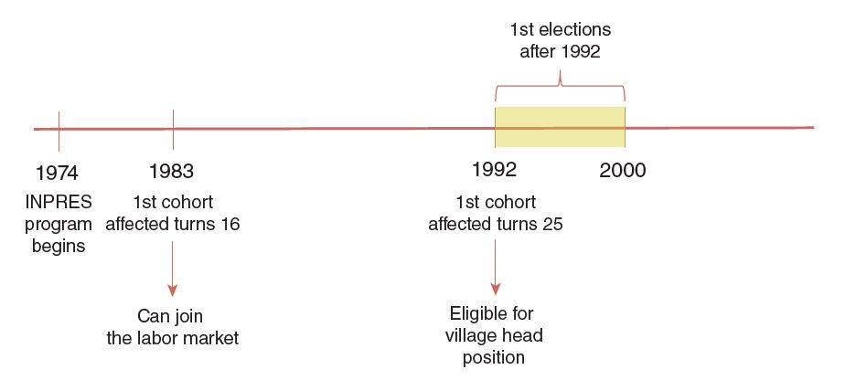
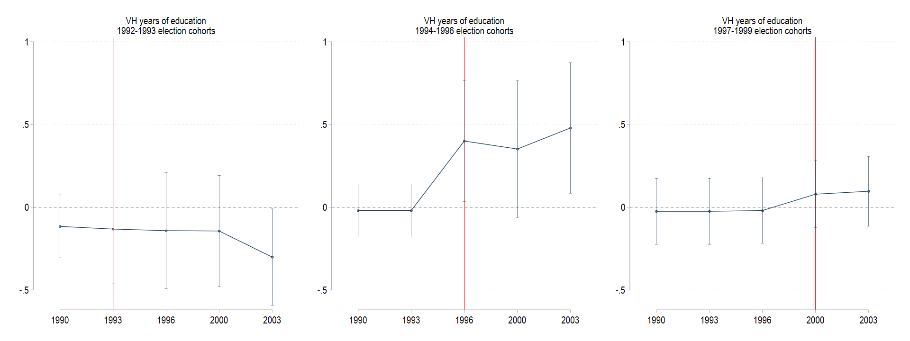
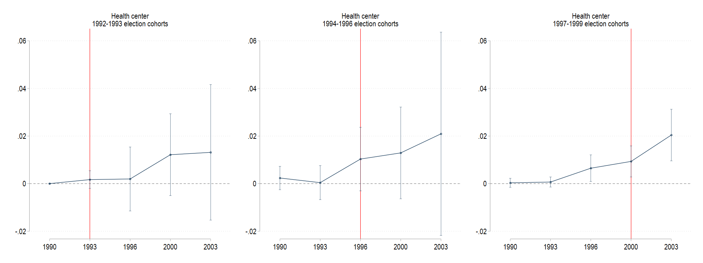
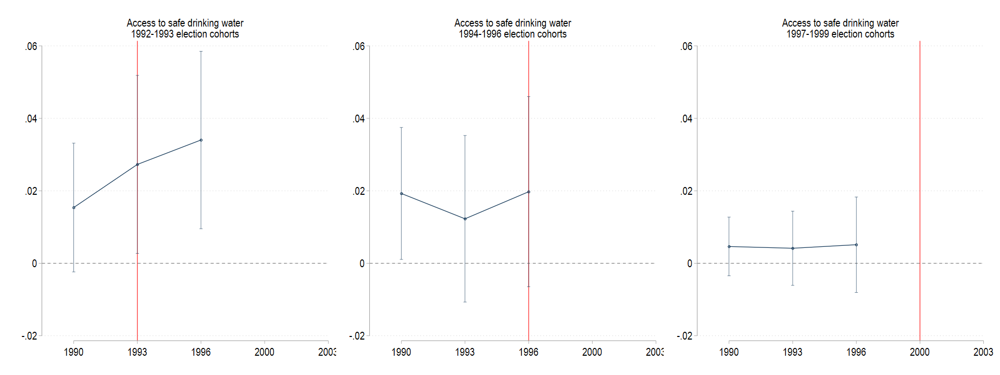
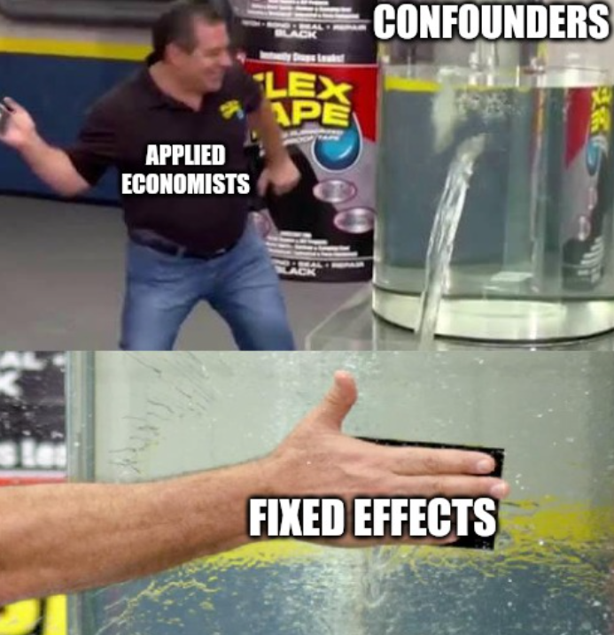
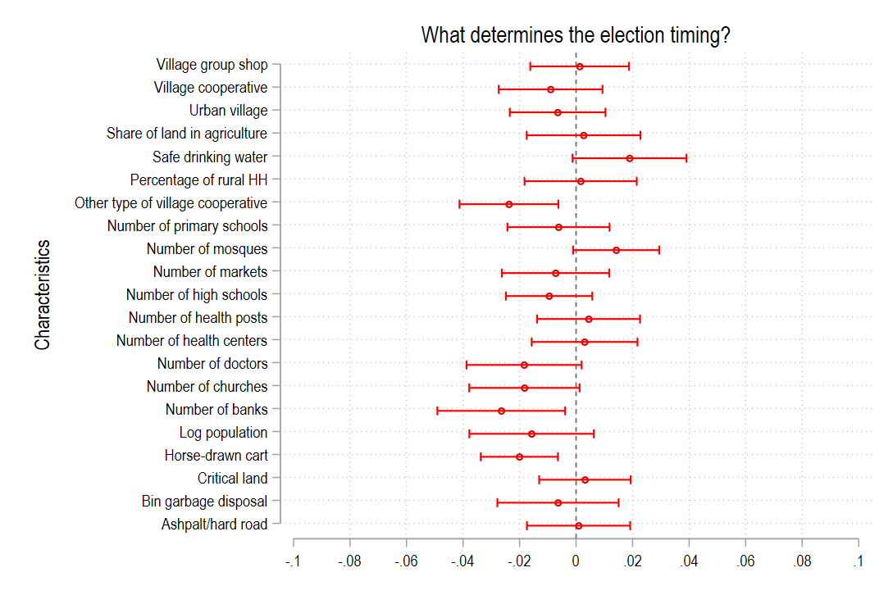

```{r xaringan-themer, echo=FALSE, include=FALSE, warning=FALSE}
library(xaringanthemer)
style_mono_light(
  base_color = "#23395b",
  header_font_google = google_font("Josefin Sans"),
  text_font_google   = google_font("Montserrat", "400", "500i"),
  code_font_google   = google_font("Fira Mono")
)
```

```{r xaringan-panelset, echo = FALSE}
xaringanExtra::use_panelset()
```

```{css, echo = FALSE}

.remark-code {
  font-size: 12px;
}
.huge .remark-code { /*Change made here*/
  font-size: 200% !important;
}

.medsmall .remark-code { /*Change made here*/
  font-size: 80% !important;
}

.small .remark-code { /*Change made here*/
  font-size: 70% !important;
}

.vsmall .remark-code { /*Change made here*/
  font-size: 50% !important;
}

.tiny .remark-code { /*Change made here*/
  font-size: 40% !important;
}

.vvlarge { font-size: 170% }
.vlarge { font-size: 150% }
.large { font-size: 130% }
.medlarge { font-size: 115% }
.medsmall { font-size: 80% }
.small { font-size: 60% }
.vsmall { font-size: 50% }
.tiny { font-size: 40% }

```

```{r setup, include = FALSE}
knitr::opts_chunk$set(echo = FALSE, 
                      message = FALSE,
                      warning = FALSE)
library(tidyverse)
library(knitr)
library(kableExtra)
library(Statamarkdown)
library(stargazer)
library(fixest)
```

# What motivated the paper?

* There have been massive increases in school enrollment and educational attainment 
among developing countries in the last decades


--

* How would this affect local governance?

--

* Martinez-Bravo (MB, 2017) looks at **the impact of large school construction program** 
in Indonesia (the INPRES program) on **village governance and public good provisions**.

---
# The author's hypothesis

```{r theory_of_change}
DiagrammeR::grViz(" digraph {

                  graph [layout = dot, rankdir = LR]
  
                  # node definitions with substituted label text
                  node [shape = rectangle, fontsize = 7, fontname = 'Montserrat']
                  input [label = 'INPRES school \nconstruction \nprogram']
                  output [label = 'Increased education \nof village head \ncandidates']
                  outcome1 [label = 'Better reallocation \nof village \nbudgets']
                  outcome2 [label = 'Efficient project \nmanagement']
                  impact [label = 'Better \nprovision of \npublic goods']
                  
                  # defining the edge
                  input -> output -> outcome1 -> impact
                  output -> outcome2 -> impact
                  }",
                  height = 500, width = 800)
```

---

# How the author does it 

* **Key institutional feature**: 

    + INPRES program started in 1974
    
--
    + Village head candidates must be at least 25 years old
--

* **Treatment**: Village-elections in which newly educated cohorts (the INPRES cohorts) 
could run as village head candidates

--

* **Outcome**: Village-level public good provisions

--

* MB used DiD strategy to compare village-level outcomes among:
  
--
  
    + Villages before and after the INPRES cohorts could run as candidates 
--
    + Villages that had run their first INPRES cohort elections and those that had not
    
---
# What's the result?

* First election to which the newly educated cohorts could run as candidates 
led to **increases in provision of key public goods**:

--

    + Number of doctors
--
    + Presence of primary health care centers
--
    + Access to basic services, i.e., safe drinking water and garbage disposal
--

* Effects are **stronger** for villages where the INPRES program was more intense. 

--

* Effects are heterogenous across villages as a function of villagers' 
**demand for public goods**.

--

* Validating the hypothesized causal pathways:

--
    
    + **First-stage**: INPRES school constructions induced increased in the education of village head 
    that is ultimately elected 
--
    + **Second-stage**: More educated village heads are better at reallocating their budgets and managing their projects 

---
# Data


* Data: Village Potentials (*Potensi Desa*), merged with INPRES school data
--

    
    + Between 1986 - 2003

    + Java island only: 9,855 villages (excluding *kelurahan*), 
    4 provinces, 82 districts

--

* Full paper dataset can be downloaded <span style="text-decoration:underline">[here](https://github.com/jswsean/isa_workshop/tree/main/walkthrough/113664-V1/AEJApp-2015-0447_Dataset)</span>. 

---
# Methods: key institutional feature


* First cohort 'treated' by INPRES schools: 7 YOs in 1974

--

    + First INPRES cohort will be eligible to run for office by 1992 (25 Y.O.)

--

* Villages run elections every 8 years 

--

* Election timing varies across villages

--

* Year of first election post-1992 captures the timing at which INPRES cohorts could start running for office.

---
# Methods: key institutional feature


<figcaption><i>Source: Martinez-Bravo (2017)</i></figcaption>


---
# Methods: key institutional feature

* Does the timing of increase in public good provision correspond to the 
timing of first post-1992 election? 

  $$y_{vt} = \beta_0 + \sum^{2003}_{s=1990} (\delta_s \times Num\_{INPRES}_{v}) \gamma_{s} + \alpha_v + \delta_t +      \epsilon_{vt}$$

--

* $v, t$ denote villages and time periods, respectively

--

* $\gamma_s$ denotes the event-study effects of INPRES schools 
  
--

* Equation is estimated separately for different village groups (formed based on their election periods):

--

    + 1992-1993 election group
    + 1994-1996 
    + 1997-2000
    
    
---
# Methods: key institutional feature 

.panelset[
.panel[.panel-name[Stata Code]

```{stata figure1_code, results="hide", echo = TRUE, eval = FALSE}

use "$raw_data/VHeduc_Data", clear

// we set up the data as panel 
xtset v_id year

// first, we generate the election period cohort 
g election_cohort = 1993 if ele1v_post92==1992 | ele1v_post92==1993 
replace election_cohort = 1996 if ele1v_post92==1994 | ele1v_post92==1995  | ele1v_post92==1996
replace election_cohort = 2000 if ele1v_post92==1997 | ele1v_post92==1998 | ele1v_post92==1999

* performing looping across outcome variables and dependent variables 
eststo clear 
foreach y in 1993 1996 2000 {
	foreach v in dum doc safe pos garb yrsedu {
		qui eststo e_c`y'_`v' : xtreg `v' i.year##c.num_dev if ///
		election_cohort == `y', fe i(v_id) vce(cluster idkab_num) dfadj
	}
}

```
]

.panel[.panel-name[VH Education]

.center[]
]

.panel[.panel-name[Health Center]

.center[]
]

.panel[.panel-name[Doctors]

.center[]
]

.panel[.panel-name[Water]

.center[]
]
]


---

name: identification-strategy
class: medsmall

# Methods: identification strategy
 
* MB's main specification: 

  $$Y_{vt} = \lambda_0 + \lambda_1 postel92_{vt} + \lambda_2 postel92_{vt} \times Num\_INPRES{v} + \alpha_v + \delta_t + \epsilon_{vt}$$ 
--

* $postel92_{vt} = 1$ for all periods $t$ after village $v$'s first post-1992 election

--

* Important features of the equation:

--

    + **Two way fixed effects**

--
    + Time FEs $\delta_t$ control for factors that change over time, and affect all villages similarly
    (can you think of any example?)

--
    + Village FEs $\alpha_v$ control for the idiosyncrasies of each villages that 
    do not change over time.

--

.center[]


---
# Methods: identification strategy

* Assume there are only two groups, *treated* and *controls*, and two periods, *before* and *after*

--

* $A$ and $C$ are FEs of the treated and control groups, while $T$ is the time FE

--

* $D$ is the treatment effect

```{r did_table}
did_table <- tribble(
  ~village_group, ~period,  ~outcome,        ~d1,     ~d2,
  "Treated",      "Before", "$Y = A$",       "",      "",
  "Treated",      "After",  "$Y = A+(T+D)$", "$T+D$", "$D$",
  "Control",      "Before", "$Y = C$",       "",      "",
  "Control",      "After",  "$Y = C+(T)$",   "$T$",   ""
)

knitr::kable(did_table, format = 'html', 
      col.names = c('Village group', 'Period', 'Outcome', 'Diff-1', 'Diff-2')) %>% 
  kable_styling()

```

---
# Methods: identification strategy

* Identification strategy: **timing of the first post-1992 election should be conditionally random** (quasi-random)

.panelset[
.panel[.panel-name[Stata Code]
```{stata figure2_code, results="hide", echo = TRUE, eval = FALSE}

/* first, we load the VHeduc data*/

	foreach v in `vars' {
		
		* using the same indep var for regressions 
		cap drop regressor esample *_sd
		g regressor = `v'_chg90
		
		* running the stdzd regs
		* running the usual regs to obtain e(sample)
		qui reg ele1v_post92 regressor, clust(idkab_num)
		g esample = 1 if e(sample) == 1
		foreach var in ele1v_post92 regressor {
			qui su `var' if esample == 1, d
			loc mean = r(mean)
			loc sd = r(sd)
			g `var'_sd = (`var' - `mean')/`sd'
		}
		tempfile sd_`v'
		qui parmby "reg ele1v_post92_sd regressor_sd, clust(idkab_num)", ///
		idstr("sd_`ti_`v''") saving(`sd_`v'', replace) level(90)
	}
```
]

.panel[.panel-name[Output]
.center[]
]
]

---
# Methods: identification strategy 

* But what about other time-varying factors that affect INPRES program allocation and the electoral cycle? 

--

* MB flexibly controlled the initial school enrollment level (main determinant of INPRES school)

--

* MB also explored heterogeneity-analysis:

$$
\begin{aligned}
Y_{st} = \beta_0 + \beta_1 postel92_{vt} & + \beta_2 postel92_{vt} \times BadService_{v} \\
                                         & + \beta_3 postel92_{vt} + Num\_{INPRES}_{v} \\
                                         & + \beta_4 postel92_{vt} \times BadService_v \times Num\_{INPRES}_{v} \\
                                         & + \alpha_v + \delta_t + \epsilon_{vt}
\end{aligned}
$$

--

* $BadService_v = 1$ if public good $y$ was under-provided at baseline (1986)

---
# .medsmall[Results: How does school construction affect public good provision?]

.panelset[
.panel[.panel-name[Health Center]
.pull-left[
.small[
```{stata table3_health_code, eval = FALSE, echo = TRUE}

/* first, we load the VHeduc data*/
	use "$raw_data/VHeduc_Data", clear

/* we set the data as panel data */
	xtset v_id year

* model 1 
	qui eststo m1_dum: xtreg dum i.post92 i.year if !mi(dum), ///
	fe i(v_id) vce(cluster idkab_num) dfadj
			
* model 2
	qui eststo m2_dum: xtreg dum i.post92##c.num_dev i.year if !mi(dum), ///
	fe i(v_id) vce(cluster idkab_num) dfadj
		
* model 3
	qui eststo m3_dum: xtreg dum i.post92##i.inp_pos i.year if !mi(dum), ///
	fe i(v_id) vce(cluster idkab_num) dfadj

* model 4 
	qui eststo m4_dum: xtreg dum i.post92##i.num_PSINPRES1980 i.year if !mi(dum), ///
	fe i(v_id) vce(cluster idkab_num) dfadj
		
*tabulating the results
	#delimit; 
	estout m*, 
	cells(b(star fmt(3)) se(par fmt(3)))
	stats(r2 N, fmt(%9.3f %9.0f %9.3f) 
	labels("R-squared" "Observations"))
	keep(1.post92 1.post92#c.num_dev 1.post92#1.inp_pos 
	1.post92#1.num_PSINPRES1980 1.post92#2.num_PSINPRES1980)
	varlabels(1.post92 "Post first election after 1992"
			  1.post92#c.num_dev "Post X num. INPRES schools"
			  1.post92#1.inp_pos "Post X num. INPRES > 0"
			  1.post92#1.num_PSINPRES1980 "Post x INPRES schools = 1"
			  1.post92#2.num_PSINPRES1980 "Post x INPRES schools = 2")
	;
	#delimit cr	
```
]
]

.pull-right[
.small[
```{stata table3_health_output, echo = FALSE}
  gl raw_data "C:/Users/Sean Hambali/Documents/GitHub/wb_isa_workshop/walkthrough/113664-V1/AEJApp-2015-0447_Dataset"
  use "$raw_data/VHeduc_Data", clear

/* we set the data as panel data */
	qui xtset v_id year

* model 1 
	qui eststo m1_dum: xtreg dum i.post92 i.year if !mi(dum), ///
	fe i(v_id) vce(cluster idkab_num) dfadj
			
* model 2
	qui eststo m2_dum: xtreg dum i.post92##c.num_dev i.year if !mi(dum), ///
	fe i(v_id) vce(cluster idkab_num) dfadj
		
* model 3
	qui eststo m3_dum: xtreg dum i.post92##i.inp_pos i.year if !mi(dum), ///
	fe i(v_id) vce(cluster idkab_num) dfadj

* model 4 
	qui eststo m4_dum: xtreg dum i.post92##i.num_PSINPRES1980 i.year if !mi(dum), ///
	fe i(v_id) vce(cluster idkab_num) dfadj
		
*tabulating the results
	#delimit; 
	estout m*, 
	cells(b(star fmt(3)) se(par fmt(3)))
	stats(r2 N, fmt(%9.3f %9.0f %9.3f) 
	labels("R-squared" "Observations"))
	keep(1.post92 1.post92#c.num_dev 1.post92#1.inp_pos 
	1.post92#1.num_PSINPRES1980 1.post92#2.num_PSINPRES1980)
	varlabels(1.post92 "Post first election after 1992"
			  1.post92#c.num_dev "Post X num. INPRES schools"
			  1.post92#1.inp_pos "Post X num. INPRES > 0"
			  1.post92#1.num_PSINPRES1980 "Post x INPRES schools = 1"
			  1.post92#2.num_PSINPRES1980 "Post x INPRES schools = 2")
	note(*, ** and *** denote significance at 5%, 1%, and 0.1%.)
	;
	#delimit cr
```
]
]
]

.panel[.panel-name[Doctors]

.pull-left[
.small[
```{stata table3_doctor_code, eval = FALSE, echo = TRUE}
/* first, we load the VHeduc data*/
	use "$raw_data/VHeduc_Data", clear

/* we set the data as panel data */
	xtset v_id year

* model 1 
	qui eststo m1_doc: xtreg doc i.post92 i.year if !mi(doc), ///
	fe i(v_id) vce(cluster idkab_num) dfadj
			
* model 2
	qui eststo m2_doc: xtreg doc i.post92##c.num_dev i.year if !mi(doc), ///
	fe i(v_id) vce(cluster idkab_num) dfadj
		
* model 3
	qui eststo m3_doc: xtreg doc i.post92##i.inp_pos i.year if !mi(doc), ///
	fe i(v_id) vce(cluster idkab_num) dfadj

* model 4 
	qui eststo m4_doc: xtreg doc i.post92##i.num_PSINPRES1980 i.year if !mi(doc), ///
	fe i(v_id) vce(cluster idkab_num) dfadj
		
*tabulating the results
	#delimit; 
	estout m*, 
	cells(b(star fmt(3)) se(par fmt(3)))
	stats(r2 N, fmt(%9.3f %9.0f %9.3f) 
	labels("R-squared" "Observations"))
	keep(1.post92 1.post92#c.num_dev 1.post92#1.inp_pos 
	1.post92#1.num_PSINPRES1980 1.post92#2.num_PSINPRES1980)
	varlabels(1.post92 "Post first election after 1992"
			  1.post92#c.num_dev "Post X num. INPRES schools"
			  1.post92#1.inp_pos "Post X num. INPRES > 0"
			  1.post92#1.num_PSINPRES1980 "Post x INPRES schools = 1"
			  1.post92#2.num_PSINPRES1980 "Post x INPRES schools = 2")
	;
	#delimit cr	
```
]
]

.pull-right[
.small[
```{stata table3_doctor_output, echo = FALSE}
/* first, we load the VHeduc data*/
  gl raw_data "C:/Users/Sean Hambali/Documents/GitHub/wb_isa_workshop/walkthrough/113664-V1/AEJApp-2015-0447_Dataset"
	use "$raw_data/VHeduc_Data", clear

/* we set the data as panel data */
	qui xtset v_id year

* model 1 
	qui eststo m1_doc: xtreg doc i.post92 i.year if !mi(doc), ///
	fe i(v_id) vce(cluster idkab_num) dfadj
			
* model 2
	qui eststo m2_doc: xtreg doc i.post92##c.num_dev i.year if !mi(doc), ///
	fe i(v_id) vce(cluster idkab_num) dfadj
		
* model 3
	qui eststo m3_doc: xtreg doc i.post92##i.inp_pos i.year if !mi(doc), ///
	fe i(v_id) vce(cluster idkab_num) dfadj

* model 4 
	qui eststo m4_doc: xtreg doc i.post92##i.num_PSINPRES1980 i.year if !mi(doc), ///
	fe i(v_id) vce(cluster idkab_num) dfadj
		
*tabulating the results
	#delimit; 
	estout m*, 
	cells(b(star fmt(3)) se(par fmt(3)))
	stats(r2 N, fmt(%9.3f %9.0f %9.3f) 
	labels("R-squared" "Observations"))
	keep(1.post92 1.post92#c.num_dev 1.post92#1.inp_pos 
	1.post92#1.num_PSINPRES1980 1.post92#2.num_PSINPRES1980)
	varlabels(1.post92 "Post first election after 1992"
			  1.post92#c.num_dev "Post X num. INPRES schools"
			  1.post92#1.inp_pos "Post X num. INPRES > 0"
			  1.post92#1.num_PSINPRES1980 "Post x INPRES schools = 1"
			  1.post92#2.num_PSINPRES1980 "Post x INPRES schools = 2")
	note(*, ** and *** denote significance at 5%, 1%, and 0.1%.)
	;
	#delimit cr	
```
]
]
]

.panel[.panel-name[Drinking Water]
.pull-left[
.small[
```{stata table3_water_code, eval = FALSE, echo = TRUE}
/* first, we load the VHeduc data*/
	use "$raw_data/VHeduc_Data", clear

/* we set the data as panel data */
	xtset v_id year

* model 1 
	qui eststo m1_safe: xtreg safe i.post92 i.year if !mi(safe), ///
	fe i(v_id) vce(cluster idkab_num) dfadj
			
* model 2
	qui eststo m2_safe: xtreg safe i.post92##c.num_dev i.year if !mi(safe), ///
	fe i(v_id) vce(cluster idkab_num) dfadj
		
* model 3
	qui eststo m3_safe: xtreg safe i.post92##i.inp_pos i.year if !mi(safe), ///
	fe i(v_id) vce(cluster idkab_num) dfadj

* model 4 
	qui eststo m4_safe: xtreg safe i.post92##i.num_PSINPRES1980 i.year if !mi(safe), ///
	fe i(v_id) vce(cluster idkab_num) dfadj
		
*tabulating the results
	#delimit; 
	estout m*, 
	cells(b(star fmt(3)) se(par fmt(3)))
	stats(r2 N, fmt(%9.3f %9.0f %9.3f) 
	labels("R-squared" "Observations"))
	keep(1.post92 1.post92#c.num_dev 1.post92#1.inp_pos 
	1.post92#1.num_PSINPRES1980 1.post92#2.num_PSINPRES1980)
	varlabels(1.post92 "Post first election after 1992"
			  1.post92#c.num_dev "Post X num. INPRES schools"
			  1.post92#1.inp_pos "Post X num. INPRES > 0"
			  1.post92#1.num_PSINPRES1980 "Post x INPRES schools = 1"
			  1.post92#2.num_PSINPRES1980 "Post x INPRES schools = 2")
	;
	#delimit cr	
```
]
]

.pull-right[
.small[
```{stata table3_water_output, echo = FALSE}
/* first, we load the VHeduc data*/
  gl raw_data "C:/Users/Sean Hambali/Documents/GitHub/wb_isa_workshop/walkthrough/113664-V1/AEJApp-2015-0447_Dataset"
	use "$raw_data/VHeduc_Data", clear

/* we set the data as panel data */
	qui xtset v_id year

* model 1 
	qui eststo m1_safe: xtreg safe i.post92 i.year if !mi(safe), ///
	fe i(v_id) vce(cluster idkab_num) dfadj
			
* model 2
	qui eststo m2_safe: xtreg safe i.post92##c.num_dev i.year if !mi(safe), ///
	fe i(v_id) vce(cluster idkab_num) dfadj
		
* model 3
	qui eststo m3_safe: xtreg safe i.post92##i.inp_pos i.year if !mi(safe), ///
	fe i(v_id) vce(cluster idkab_num) dfadj

* model 4 
	qui eststo m4_safe: xtreg safe i.post92##i.num_PSINPRES1980 i.year if !mi(safe), ///
	fe i(v_id) vce(cluster idkab_num) dfadj
		
*tabulating the results
	#delimit; 
	estout m*, 
	cells(b(star fmt(3)) se(par fmt(3)))
	stats(r2 N, fmt(%9.3f %9.0f %9.3f) 
	labels("R-squared" "Observations"))
	keep(1.post92 1.post92#c.num_dev 1.post92#1.inp_pos 
	1.post92#1.num_PSINPRES1980 1.post92#2.num_PSINPRES1980)
	varlabels(1.post92 "Post first election after 1992"
			  1.post92#c.num_dev "Post X num. INPRES schools"
			  1.post92#1.inp_pos "Post X num. INPRES > 0"
			  1.post92#1.num_PSINPRES1980 "Post x INPRES schools = 1"
			  1.post92#2.num_PSINPRES1980 "Post x INPRES schools = 2")
	note(*, ** and *** denote significance at 5%, 1%, and 0.1%.)
	;
	#delimit cr	
```
]
]
]
]
---
# .medsmall[Results: How does the effect vary?]

.panelset[

.panel[.panel-name[Stata Code]
.small[
```{stata table4_het_code, echo = TRUE, eval = FALSE}
  
  use "$raw_data/VHeduc_Data", clear
	
	/* setting the panel data */
	xtset v_id year
	
	/* storing the depvars in the global */
	gl depvars dum doc safe 
	
	/* running the regressions */
	eststo clear
	foreach v in $depvars {
		
		* generating dummy for whether bad baseline var/not 
		cap drop badvar
		g badvar = b`v'
		
		* running the first model : c.num_dev as the interaction variable 
		qui eststo m1_`v' : xtreg `v' i.post92##c.num_dev##i.badvar	i.year if !mi(`v'), fe i(v_id) vce(cluster idkab_num) dfadj
		
		* adding baseline mean
			qui su `v' if e(sample) == 1 
			loc mean = r(mean)
			qui estadd scalar depvar_mean `mean'
		
		
		* running the second model : positive inpres dummies as the interaction variable 
		qui eststo m2_`v' : xtreg `v' i.post92##i.inp_pos##i.badvar i.year if !mi(`v'), fe i(v_id) vce(cluster idkab_num) dfadj
		
		* adding baseline mean
			qui su `v' if e(sample) == 1 
			loc mean = r(mean)
			qui estadd scalar depvar_mean `mean'
	}
```
]
]

.panel[.panel-name[Output]
```{stata table4_het_output, echo = FALSE}
/* first, we load the raw data */
  gl raw_data "C:/Users/Sean Hambali/Documents/GitHub/wb_isa_workshop/walkthrough/113664-V1/AEJApp-2015-0447_Dataset"
	use "$raw_data/VHeduc_Data", clear
	
	/* setting the panel data */
	qui xtset v_id year
	
	/* storing the depvars in the global */
	gl depvars dum doc safe 
	
	/* running the regressions */
	eststo clear
	foreach v in $depvars {
		
		* generating dummy for whether bad baseline var/not 
		cap drop badvar
		g badvar = b`v'
		
		* running the first model : c.num_dev as the interaction variable 
		qui eststo m1_`v' : xtreg `v' i.post92##c.num_dev##i.badvar i.year if !mi(`v'), fe i(v_id) vce(cluster idkab_num) dfadj
		
		* adding baseline mean
			qui su `v' if e(sample) == 1 
			loc mean = r(mean)
			qui estadd scalar depvar_mean `mean'
		
		
		* running the second model : positive inpres dummies as the interaction variable 
		qui eststo m2_`v' : xtreg `v' i.post92##i.inp_pos##i.badvar i.year if !mi(`v'), fe i(v_id) vce(cluster idkab_num) dfadj
		
		* adding baseline mean
			qui su `v' if e(sample) == 1 
			loc mean = r(mean)
			qui estadd scalar depvar_mean `mean'
	}
	
	#delimit; 
	estout m*, cells(b(star fmt(3)) se(par fmt(3)))
	modelwidth(7) stats(r2 N depvar_mean, fmt(%9.3f %9.0f %9.2f) 
	labels("R-squared" "Observations" "Mean"))
	keep(1.post92 1.post92#c.num_dev 1.post92#1.inp_pos 1.post92#1.badvar 
	1.post92#1.badvar#c.num_dev 1.post92#1.inp_pos#1.badvar)
	order(1.post92 1.post92#c.num_dev 1.post92#1.inp_pos 1.post92#1.badvar 
	1.post92#1.badvar#c.num_dev 1.post92#1.inp_pos#1.badvar)
	varlabels(1.post92 "Post first election after 1992"
			  1.post92#c.num_dev "Post X INPRES N"
			  1.post92#1.inp_pos "Post X INPRES > 0"
			  1.post92#1.badvar "Post X bad service"
			  1.post92#1.badvar#c.num_dev "Post x bad service X INPRES intensity"
			  1.post92#1.inp_pos#1.badvar "Post x bad service X INPRES > 0"
			  )
	note(*, ** and *** denote significance at 5%, 1%, and 0.1%.)
	;
	#delimit cr
```
]
]

---
# Results: Robustness checks

* Potential concerns: 

    1. Could different village sizes explain the results?
    
--

    2. Could villages with different pre-treatment levels have different underlying trends in public good provision?
    
--

    3. What about the 3 variables that were found to be correlated with timing elections? 
    
--

    4. But INPRES school allocation is not random, right? 
    
--

    5. Are there any pre-trends?

---
# Results: Robustness checks

.panelset[

.panel[.panel-name[Stata Code]
.small[
```{stata table5_code, eval = FALSE, echo = TRUE}
  
  /* first, we load the raw data */
	use "$raw_data/VHeduc_Data", clear
	
	/* setting the panel data */
	xtset v_id year
	
	/* storing the depvars in the global */
	gl depvars dum doc safe 
	
	/* looping across the dependent variable and specification */
	foreach v in $depvars {
		
		* spec #1: controlling for log population
		qui eststo m1_`v': xtreg `v' i.post92##c.num_dev i.year lpopulation if !mi(`v'), fe i(v_id) vce(cluster idkab_num) dfadj
		
		* spec #2: controlling for pre-treatment dep var x year FE
		qui eststo m2_`v': xtreg `v' i.post92##c.num_dev i.year i.year#c.`v'_pre if !mi(`v'), fe i(v_id) vce(cluster idkab_num) dfadj
		
		* spec #3: controlling for pre-treatment covariates 
		qui eststo m3_`v': xtreg `v' i.post92##c.num_dev i.year i.year##c.dum_otrocop_pre i.year##c.num_bank_pre i.year##c.pedati_pre if !mi(`v'), fe i(v_id) vce(cluster idkab_num) dfadj
		
		* spec #4: controlling for initial school enrollment and enrollment / water sanitation X year FE
		qui eststo m4_`v': xtreg `v' i.post92##c.num_dev i.year i.year#c.sch_rate86 i.year#i.Inptoil if !mi(`v'), fe i(v_id) vce(cluster idkab_num) dfadj
		
		* spec #5: exploring pre-trends
		qui eststo m5_`v': xtreg `v' post92 ye_3_1_num_dev-ye_3_4_num_dev i.year if !mi(`v'), fe i(v_id) vce(cluster idkab_num) dfadj
		
		* tabulating the results
		estout m*, cells(b(star fmt(3)) se(par fmt(3))) modelwidth(7) stats(r2 N, fmt(%9.3f %9.0f) labels("R-squared" "Observations")) keep(1.post92 1.post92#c.num_dev ye_3_1_num_dev ye_3_2_num_dev ye_3_3_num_dev) ///
		order(1.post92 1.post92#c.num_dev ye_3_3_num_dev ye_3_2_num_dev ye_3_1_num_dev) ///
		varlabels(1.post92 "Post" 1.post92#c.num_dev "Post X INPRES N" ye_3_1_num_dev "3 year before X INPRES N" ye_3_2_num_dev "2 year before X INPRES N" ye_3_3_num_dev "1 year before X INPRES N")
		
		eststo clear 
	}
```

]
]

.panel[.panel-name[Health Centers]
```{stata table5_health_output, echo = FALSE}
/* first, we load the raw data */
  gl raw_data "C:/Users/Sean Hambali/Documents/GitHub/wb_isa_workshop/walkthrough/113664-V1/AEJApp-2015-0447_Dataset"
	use "$raw_data/VHeduc_Data", clear
	
	/* setting the panel data */
	qui xtset v_id year
		
	* spec #1: controlling for log population
	qui eststo m1_dum: xtreg dum i.post92##c.num_dev i.year lpopulation if !mi(dum), fe i(v_id) vce(cluster idkab_num) dfadj
	
	* spec #2: controlling for pre-treatment dep var x year FE
	qui eststo m2_dum: xtreg dum i.post92##c.num_dev i.year i.year#c.dum_pre if !mi(dum), fe i(v_id) vce(cluster idkab_num) dfadj
	
	* spec #3: controlling for pre-treatment covariates 
	qui eststo m3_dum: xtreg dum i.post92##c.num_dev i.year i.year##c.dum_otrocop_pre i.year##c.num_bank_pre i.year##c.pedati_pre if !mi(dum), fe i(v_id) vce(cluster idkab_num) dfadj
		
	* spec #4: controlling for initial school enrollment and enrollment / water sanitation X year FE
	qui eststo m4_dum: xtreg dum i.post92##c.num_dev i.year i.year#c.sch_rate86 i.year#i.Inptoil if !mi(dum), fe i(v_id) vce(cluster idkab_num) dfadj
		
	* spec #5: 
	qui eststo m5_dum: xtreg dum post92 ye_3_1_num_dev-ye_3_4_num_dev i.year if !mi(dum), fe i(v_id) vce(cluster idkab_num) dfadj
		
	* estout 
	estout m*, cells(b(star fmt(3)) se(par fmt(3))) modelwidth(8) stats(r2 N, fmt(%9.3f %9.0f) labels("R-squared" "Observations")) keep(1.post92 1.post92#c.num_dev ye_3_1_num_dev ye_3_2_num_dev ye_3_3_num_dev) order(1.post92 1.post92#c.num_dev ye_3_3_num_dev ye_3_2_num_dev ye_3_1_num_dev) varlabels(1.post92 "Post" 1.post92#c.num_dev "Post X INPRES N" ye_3_1_num_dev "3 year before X INPRES N" ye_3_2_num_dev "2 year before X INPRES N" ye_3_3_num_dev "1 year before X INPRES N") note(*, ** and *** denote significance at 5%, 1%, and 0.1%.)
```
]

.panel[.panel-name[Doctors]
```{stata table5_doctor_output, echo = FALSE}
/* first, we load the raw data */
  gl raw_data "C:/Users/Sean Hambali/Documents/GitHub/wb_isa_workshop/walkthrough/113664-V1/AEJApp-2015-0447_Dataset"
	use "$raw_data/VHeduc_Data", clear
	
	/* setting the panel data */
	qui xtset v_id year
		
	* spec #1: controlling for log population
	qui eststo m1_doc: xtreg doc i.post92##c.num_dev i.year lpopulation if !mi(doc), fe i(v_id) vce(cluster idkab_num) dfadj
	
	* spec #2: controlling for pre-treatment dep var x year FE
	qui eststo m2_doc: xtreg doc i.post92##c.num_dev i.year i.year#c.doc_pre if !mi(doc), fe i(v_id) vce(cluster idkab_num) dfadj
	
	* spec #3: controlling for pre-treatment covariates 
	qui eststo m3_doc: xtreg doc i.post92##c.num_dev i.year i.year##c.dum_otrocop_pre i.year##c.num_bank_pre i.year##c.pedati_pre if !mi(doc), fe i(v_id) vce(cluster idkab_num) dfadj
		
	* spec #4: controlling for initial school enrollment and enrollment / water sanitation X year FE
	qui eststo m4_doc: xtreg doc i.post92##c.num_dev i.year i.year#c.sch_rate86 i.year#i.Inptoil if !mi(doc), fe i(v_id) vce(cluster idkab_num) dfadj
		
	* spec #5: 
	qui eststo m5_doc: xtreg doc post92 ye_3_1_num_dev-ye_3_4_num_dev i.year if !mi(doc), fe i(v_id) vce(cluster idkab_num) dfadj
		
	* estout 
	estout m*, cells(b(star fmt(3)) se(par fmt(3))) modelwidth(8) stats(r2 N, fmt(%9.3f %9.0f) labels("R-squared" "Observations")) keep(1.post92 1.post92#c.num_dev ye_3_1_num_dev ye_3_2_num_dev ye_3_3_num_dev) order(1.post92 1.post92#c.num_dev ye_3_3_num_dev ye_3_2_num_dev ye_3_1_num_dev) varlabels(1.post92 "Post" 1.post92#c.num_dev "Post X INPRES N" ye_3_1_num_dev "3 year before X INPRES N" ye_3_2_num_dev "2 year before X INPRES N" ye_3_3_num_dev "1 year before X INPRES N") note(*, ** and *** denote significance at 5%, 1%, and 0.1%.)
```

]

.panel[.panel-name[Drinking Water]
```{stata table5_water_output, echo = FALSE}
  gl raw_data "C:/Users/Sean Hambali/Documents/GitHub/wb_isa_workshop/walkthrough/113664-V1/AEJApp-2015-0447_Dataset"
	use "$raw_data/VHeduc_Data", clear
	
	/* setting the panel data */
	qui xtset v_id year
		
	* spec #1: controlling for log population
	qui eststo m1_safe: xtreg safe i.post92##c.num_dev i.year lpopulation if !mi(safe), fe i(v_id) vce(cluster idkab_num) dfadj
	
	* spec #2: controlling for pre-treatment dep var x year FE
	qui eststo m2_safe: xtreg safe i.post92##c.num_dev i.year i.year#c.safe_pre if !mi(safe), fe i(v_id) vce(cluster idkab_num) dfadj
	
	* spec #3: controlling for pre-treatment covariates 
	qui eststo m3_safe: xtreg safe i.post92##c.num_dev i.year i.year##c.dum_otrocop_pre i.year##c.num_bank_pre i.year##c.pedati_pre if !mi(safe), fe i(v_id) vce(cluster idkab_num) dfadj
		
	* spec #4: controlling for initial school enrollment and enrollment / water sanitation X year FE
	qui eststo m4_safe: xtreg safe i.post92##c.num_dev i.year i.year#c.sch_rate86 i.year#i.Inptoil if !mi(safe), fe i(v_id) vce(cluster idkab_num) dfadj
		
	* spec #5: 
	qui eststo m5_safe: xtreg safe post92 ye_3_1_num_dev-ye_3_4_num_dev i.year if !mi(safe), fe i(v_id) vce(cluster idkab_num) dfadj
		
	* estout 
	estout m*, cells(b(star fmt(3)) se(par fmt(3))) modelwidth(8) stats(r2 N, fmt(%9.3f %9.0f) labels("R-squared" "Observations")) keep(1.post92 1.post92#c.num_dev ye_3_1_num_dev ye_3_2_num_dev ye_3_3_num_dev) order(1.post92 1.post92#c.num_dev ye_3_3_num_dev ye_3_2_num_dev ye_3_1_num_dev) varlabels(1.post92 "Post" 1.post92#c.num_dev "Post X INPRES N" ye_3_1_num_dev "3 year before X INPRES N" ye_3_2_num_dev "2 year before X INPRES N" ye_3_3_num_dev "1 year before X INPRES N") note(*, ** and *** denote significance at 5%, 1%, and 0.1%.)
```

]
]

---
# .medsmall[Results: What are the effect's mechanisms?]

* **How could the influx of educated candidates influence public good provision?**

--

    1. Through changes in village head's education 
    
--
      
      + VH that ultimately gets elected is more educated
--
      + Equilibrium effect
      
--
    2. Through changes in electorate's education
    
--
      
      + MB already mitigated this possibility by including year FE 
--
      + MB also controlled for average education of the electorate in each village.
      
---
# .medsmall[Results: What are the effect's mechanisms?]

.panelset[

.panel[.panel-name[Stata Code]
.small[
```{stata table6_code, eval = FALSE, echo = TRUE}
  use "$raw_data/VHeduc_Data", clear
	
	* panel data setup 
	xtset v_id year
	
	eststo clear
	* running model #1
	qui eststo m1: xtreg yrsedu i.post92 i.year, fe i(v_id) vce(cluster idkab_num) dfadj
	
	* running model #2
	qui eststo m2: xtreg yrsedu i.post92##c.num_dev i.year, fe i(v_id) vce(cluster idkab_num) dfadj
	
	* running model #3
	qui eststo m3: xtreg yrsedu i.post92##i.inp_pos i.year, fe i(v_id) vce(cluster idkab_num) dfadj
	
	* running model #4
	qui eststo m4: xtreg yrsedu i.post92##i.num_PSINPRES1980 i.year, fe i(v_id) vce(cluster idkab_num) dfadj
	
	* running model #5
	qui eststo m5: xtreg yrsedu ib0.post92##ib0.young i.year, fe i(v_id) vce(cluster idkab_num) dfadj
	
	* running model #6
	qui eststo m6: xtreg yrsedu ib0.post92##ib0.young##c.num_dev i.year, ///
	fe i(v_id) vce(cluster idkab_num) dfadj
	
	estout m*, cells(b(star fmt(3)) se(par fmt(3))) modelwidth(9) stats(r2 N, fmt(%9.3f %9.0f) labels("R-squared" "Observations")) ///
		keep(1.post92 1.post92#c.num_dev 1.post92#1.inp_pos ///
		1.post92#1.num_PSINPRES1980 1.post92#2.num_PSINPRES1980 1.post92#1.young 1.post92#1.young#c.num_dev) ///
		order(1.post92 1.post92#c.num_dev 1.post92#1.inp_pos ///
		1.post92#1.num_PSINPRES1980 1.post92#2.num_PSINPRES1980 1.post92#1.young 1.post92#1.young#c.num_dev)
```
]
]

.panel[.panel-name[Output]
```{stata table6_output}
  gl raw_data "C:/Users/Sean Hambali/Documents/GitHub/wb_isa_workshop/walkthrough/113664-V1/AEJApp-2015-0447_Dataset"
  use "$raw_data/VHeduc_Data", clear
	
	* panel data setup 
	qui xtset v_id year
	
	eststo clear
	* running model #1
	qui eststo m1: xtreg yrsedu i.post92 i.year, fe i(v_id) vce(cluster idkab_num) dfadj
	
	* running model #2
	qui eststo m2: xtreg yrsedu i.post92##c.num_dev i.year, fe i(v_id) vce(cluster idkab_num) dfadj
	
	* running model #3
	qui eststo m3: xtreg yrsedu i.post92##i.inp_pos i.year, fe i(v_id) vce(cluster idkab_num) dfadj
	
	* running model #4
	qui eststo m4: xtreg yrsedu i.post92##i.num_PSINPRES1980 i.year, fe i(v_id) vce(cluster idkab_num) dfadj
	
	* running model #5
	qui eststo m5: xtreg yrsedu ib0.post92##ib0.young i.year, fe i(v_id) vce(cluster idkab_num) dfadj
	
	* running model #6
	qui eststo m6: xtreg yrsedu ib0.post92##ib0.young##c.num_dev i.year, ///
	fe i(v_id) vce(cluster idkab_num) dfadj
	
	estout m*, cells(b(star fmt(3)) se(par fmt(3))) modelwidth(7) ///
		stats(r2 N, fmt(%9.3f %9.0f) labels("R-squared" "Observations")) ///
		keep(1.post92 1.post92#c.num_dev 1.post92#1.inp_pos ///
		1.post92#1.num_PSINPRES1980 1.post92#2.num_PSINPRES1980 1.post92#1.young 1.post92#1.young#c.num_dev) ///
		order(1.post92 1.post92#c.num_dev 1.post92#1.inp_pos ///
		1.post92#1.num_PSINPRES1980 1.post92#2.num_PSINPRES1980 1.post92#1.young 1.post92#1.young#c.num_dev)

```
]
]


---
# .medsmall[Results: What are the effect's mechanisms?]

* **How does increased VH education affect public goods provision?**

--

    1. Obtaining more funds from upper levels of government

--
    2. Reallocation of village expenditures towards development projects
--
    3. More efficient funds use and project management 

--

* MB estimated the following cross-sectional specification using OLS and 2SLS: 

  $$Y_{vp} = \beta_0 + \beta_1 educ_v + \gamma_p + \boldsymbol X_{vp} ' \boldsymbol \delta + \epsilon_{vp}$$
* MB finds that the more educated VH:

--

    + Have higher village revenues, mainly through income within the village—not from central government

--
    + Allocate more budget on infrastructure, goods expenses, and social facilities.

---
# .medsmall[Results: What are the effect's mechanisms?]

.panelset[

.panel[.panel-name[Stata Code]
.small[
```{stata table7_code, eval = FALSE, echo = TRUE}
  use "$raw_data/projectData", clear	
	
	duplicates drop v_id, force
		
	* storing the relevant variables in global
	gl depvar numproj num_Vmanag  numproj_vil numproj_Inpres numproj_gov
	
	eststo clear 
	* looping across the depvars 
	foreach v in $depvar {
		
		* the OLS model
		qui eststo M_`v'_ols: reg `v' yrsedu i.idprop lpop* percrurHH percrurHH2-percrurHH4, cluster(idkab_num)
		
		* the 2SLS model 
		qui eststo M_`v'_iv: ivreg2 `v' i.idprop lpop* percrurHH percrurHH2-percrurHH4 (yrsedu = avg_educinkec), cluster(idkab_num)
		
	}
	
	* Now, we use the project-level data 
	use "$raw_data/projectData", clear 
	
	* the OLS model
	* without project completion and type controls
	qui eststo M_projdur1_ols : qui reg projdur yrsedu i.idprop lpop* percrurHH percrurHH2-percrurHH4, cluster(idkab_num)
	
	* with controls
	qui eststo M_projdur2_ols : qui reg projdur yrsedu i.idprop i.typeproj#i.projperct_round lpop* percrurHH percrurHH2-percrurHH4 , cluster(idkab_num)
	
	* IV model, similar specs 
	qui eststo M_projdur1_iv : qui ivreg2 projdur yrsedu i.idprop  lpop* percrurHH percrurHH2-percrurHH4 (yrsedu = avg_educinkec), cluster(idkab_num)
	qui eststo M_projdur2_iv : qui ivreg2 projdur i.idprop i.typeproj#i.projperct_round  lpop*  percrurHH percrurHH2-percrurHH4 (yrsedu = avg_educinkec) , cluster(idkab_num)
	
	* tabulating the results 
	estout M*ols, cells(b(star fmt(3)) se(par fmt(3))) keep(yrsedu) note(*, ** and *** denote significance at 5%, 1%, and 0.1%.)
	
	estout M*iv, cells(b(star fmt(3)) se(par fmt(3))) keep(yrsedu) note(*, ** and *** denote significance at 5%, 1%, and 0.1%.)
```
]
]

.panel[.panel-name[Table]
```{r table7_output}
table7 <- tribble(
  ~estimation_method,   ~col1,     ~col2,     ~col3,     ~col4,     ~col5,    ~col6,        ~col7, 
  "OLS",                "0.015",   "0.026*",  "0.025*",  "-0.013",  "0.004",   "-0.040***", "-0.036***",
  "",                   "(0.013)", "(0.012)", "(0.012)", "(0.006)", "(0.006)", "(0.013)",   "(0.013)",
  "",                   "",        "",        "",        "",        "",        "",          "",
  "2SLS",               "0.169",   "0.213",   "0.238*",  "-0.094",  "0.042",   "-0.040**",  "-0.175*", 
  "",                   "(0.108)", "(0.095)", "(0.107)", "(0.060)", "(0.052)", "(0.013)",   "(0.069)"
)

knitr::kable(table7, format = 'html', 
      col.names = c('Method', 'Number of projects', 'Number of projects managed by village', 
                    'Funding: villagers', 'Funding: central gov. grants', 
                    'Funding: central gov. budget allocation', 'Project duration', 
                    'Project duration (controlling for completion and type)')) %>% 
  kable_styling(font_size = 11) %>% 
  row_spec(0 ,  bold = F, extra_css = 'vertical-align: top !important;')
```

]
]

---
# Conclusion

* Public goods provision increased significantly after the first election 
where INPRES cohorts could run as candidates 

--

* How? 

--

    + More educated VH get elected
--
    + Shift in political equilibrium 
--

* More educated VH allocate more funds towards development projects, and manage them efficiently

