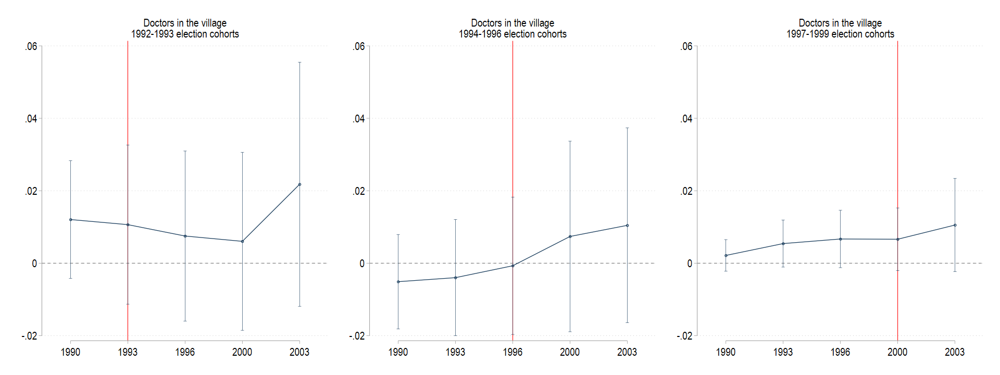

```{r xaringan-themer, echo=FALSE, include=FALSE, warning=FALSE}
library(xaringanthemer)
style_mono_light(
  base_color = "#23395b",
  header_font_google = google_font("Josefin Sans"),
  text_font_google   = google_font("Montserrat", "400", "500i"),
  code_font_google   = google_font("Fira Mono")
)
```

```{r xaringan-panelset, echo = FALSE}
xaringanExtra::use_panelset()
```

```{css, echo = FALSE}

.remark-code {
  font-size: 12px;
}
.huge .remark-code { /*Change made here*/
  font-size: 200% !important;
}
.tiny .remark-code { /*Change made here*/
  font-size: 50% !important;
}

.vvlarge { font-size: 170% }
.vlarge { font-size: 150% }
.large { font-size: 130% }
.medlarge { font-size: 115% }
.medsmall { font-size: 80% }
.small { font-size: 60% }
.tiny { font-size: 40% }

```

```{r setup, include = FALSE}
knitr::opts_chunk$set(echo = FALSE, 
                      message = FALSE,
                      warning = FALSE)
library(tidyverse)
library(knitr)
library(kableExtra)
library(Statamarkdown)
```


# What motivated the paper?

* There have been massive increases in school enrollment and educational attainment 
among developing countries in the last decades


--

* How would this affect local governance?

--

* Martinez-Bravo (MB, 2017) looks at **the impact of large school construction program** 
in Indonesia (the INPRES program) on **village governance and public good provisions**.

---
# The author's hypothesis

```{r theory_of_change}
DiagrammeR::grViz(" digraph {

                  graph [layout = dot, rankdir = LR]
  
                  # node definitions with substituted label text
                  node [shape = rectangle, fontsize = 7, fontname = 'Montserrat']
                  input [label = 'INPRES school \nconstruction \nprogram']
                  output [label = 'Increased education \nof village head \ncandidates']
                  outcome1 [label = 'Better reallocation \nof village \nbudgets']
                  outcome2 [label = 'Efficient project \nmanagement']
                  impact [label = 'Better \nprovision of \npublic goods']
                  
                  # defining the edge
                  input -> output -> outcome1 -> impact
                  output -> outcome2 -> impact
                  }",
                  height = 500, width = 800)
```

---

# How the author does it 

* **Key institutional feature**: 

    + INPRES program started in 1974
    
--
    + Village head candidates must be at least 25 years old
--

* **Treatment**: Village-elections in which newly educated cohorts (the INPRES cohorts) 
could run as village head candidates

--

* **Outcome**: Village-level public good provisions

--

* MB used DiD strategy to compare village-level outcomes among:
  
--
  
    + Villages before and after the INPRES cohorts could run as candidates 
--
    + Villages that had run their first INPRES cohort elections and those that had not
    
---
# What's the result?

* First election to which the newly educated cohorts could run as candidates 
led to **increases in provision of key public goods**:

--

    + Number of doctors
--
    + Presence of primary health care centers
--
    + Access to basic services, i.e., safe drinking water and garbage disposal
--

* Effects are **stronger** for villages where the INPRES program was more intense. 

--

* Effects are heterogenous across villages as a function of villagers' 
**demand for public goods**.

--

* Validating the hypothesized causal pathways:

--
    
    + **First-stage**: INPRES school constructions induced increased in the education of village head 
    that is ultimately elected 
--
    + **Second-stage**: More educated village heads better reallocate their budgets 
--
    + **Second-stage**: More educated village heads manage their projects better. 

---
# Data


* Data: Village Potentials (*Potensi Desa*), merged with INPRES school data
--

    
    + Between 1986 - 2003

    + Java island only: 9,855 villages (excluding *kelurahan*), 
    4 provinces, 82 districts

--

* Full paper dataset can be downloaded <span style="text-decoration:underline">[here](https://github.com/jswsean/isa_workshop/tree/main/walkthrough/113664-V1/AEJApp-2015-0447_Dataset)</span>. 

---
# Methods: key institutional feature


* First cohort 'treated' by INPRES schools: 7 YOs in 1974

--

    + First INPRES cohort will be eligible to run for office by 1992 (25 Y.O.)

--

* Villages run elections every 8 years 

--

* Election timing varies across villages

--

* Year of first election post-1992 captures the timing at which INPRES cohorts could start running for office.

---
# Methods: key institutional feature


<figcaption><i>Source: Martinez-Bravo (2017)</i></figcaption>


---
# Methods: key institutional feature

* Does the timing of increase in public good provision correspond to the 
timing of first post-1992 election? 

  $$y_{vt} = \beta_0 + \sum^{2003}_{s=1990} (\delta_s \times Num\_{INPRES}_{v}) \gamma_{s} + \alpha_v + \delta_t +      \epsilon_{vt}$$

--

* $v, t$ denote villages and time periods, respectively

--

* $\gamma_s$ denotes the event-study effects of INPRES schools 
  
--

* Equation is estimated separately for different village groups (formed based on their election periods):

--

    + 1992-1993 election group
    + 1994-1996 
    + 1997-2000
    
    
---
# Methods: key institutional feature 

.panelset[
.panel[.panel-name[Stata Code]

```{stata figure1_code, results="hide", echo = TRUE, eval = FALSE}

use "$raw_data/VHeduc_Data", clear

// we set up the data as panel 
xtset v_id year

// first, we generate the election period cohort 
g election_cohort = 1993 if ele1v_post92==1992 | ele1v_post92==1993 
replace election_cohort = 1996 if ele1v_post92==1994 | ele1v_post92==1995  | ele1v_post92==1996
replace election_cohort = 2000 if ele1v_post92==1997 | ele1v_post92==1998 | ele1v_post92==1999

* performing looping across outcome variables and dependent variables 
eststo clear 
foreach y in 1993 1996 2000 {
	foreach v in dum doc safe pos garb yrsedu {
		qui eststo e_c`y'_`v' : xtreg `v' i.year##c.num_dev if ///
		election_cohort == `y', fe i(v_id) vce(cluster idkab_num) dfadj
	}
}

```
]

.panel[.panel-name[VH Education]

.center[]
]

.panel[.panel-name[Health Center]

.center[]
]

.panel[.panel-name[Doctors]

.center[]
]

.panel[.panel-name[Water]

.center[]
]
]


---

name: identification-strategy
class: medsmall

# Methods: identification strategy
 
* MB's main specification: 

  $$Y_{vt} = \lambda_0 + \lambda_1 postel92_{vt} + \lambda_2 postel92_{vt} \times Num\_INPRES{v} + \alpha_v + \delta_t + \epsilon_{vt}$$ 
--

* $postel92_{vt} = 1$ for all periods $t$ after village $v$'s first post-1992 election

--

* Important features of the equation:

--

    + **Two way fixed effects**

--
    + Time FEs $\delta_t$ control for factors that change over time, and affect all villages similarly
    (can you think of any example?)

--
    + Village FEs $\alpha_v$ control for the idiosyncrasies of each villages that 
    do not change over time.

--

.center[]


---
# Methods: identification strategy

* Assume there are only two groups, *treated* and *controls*, and two periods, *before* and *after*

* $A$ and $C$ are FEs of the treated and control groups, while $T$ is the time FE

* $D$ is the treatment effect

```{r did_table}
did_table <- tribble(
  ~village_group, ~period,  ~outcome,        ~d1,     ~d2,
  "Treated",      "Before", "$Y = A$",       "",      "",
  "Treated",      "After",  "$Y = A+(T+D)$", "$T+D$", "$D$",
  "Control",      "Before", "$Y = C$",       "",      "",
  "Control",      "After",  "$Y = C+(T)$",   "$T$",   ""
)

knitr::kable(did_table, format = 'html', 
      col.names = c('Village group', 'Period', 'Outcome', 'Diff-1', 'Diff-2')) %>% 
  kable_styling()

```

---
# Methods: identification strategy

* Identification strategy: **timing of the first post-1992 election should be conditionally random** (quasi-random)

.panelset[
.panel[.panel-name[Stata Code]
```{stata figure2_code, results="hide", echo = TRUE, eval = FALSE}

/* first, we load the VHeduc data*/

	foreach v in `vars' {
		
		* using the same indep var for regressions 
		cap drop regressor esample *_sd
		g regressor = `v'_chg90
		
		* running the stdzd regs
		* running the usual regs to obtain e(sample)
		qui reg ele1v_post92 regressor, clust(idkab_num)
		g esample = 1 if e(sample) == 1
		foreach var in ele1v_post92 regressor {
			qui su `var' if esample == 1, d
			loc mean = r(mean)
			loc sd = r(sd)
			g `var'_sd = (`var' - `mean')/`sd'
		}
		tempfile sd_`v'
		qui parmby "reg ele1v_post92_sd regressor_sd, clust(idkab_num)", ///
		idstr("sd_`ti_`v''") saving(`sd_`v'', replace) level(90)
	}
```
]

.panel[.panel-name[Output]
.center[]
]
]

---
# Methods: identification strategy 

* But what about other time-varying factors that affect INPRES program allocation and the electoral cycle? 

--

* MB flexibly controlled the initial school enrollment level (main determinant of INPRES school)

--

* MB also explored heterogeneity-analysis:

$$
\begin{aligned}
Y_{st} = \beta_0 + \beta_1 postel92_{vt} & + \beta_2 postel92_{vt} \times BadService_{v} \\
                                         & + \beta_3 postel92_{vt} + Num\_{INPRES}_{v} \\
                                         & + \beta_4 postel92_{vt} \times BadService_v \times Num\_{INPRES}_{v} \\
                                         & + \alpha_v + \delta_t + \epsilon_{vt}
\end{aligned}
$$

--

* $BadService_v = 1$ if public good $y$ was under-provided at baseline (1986)

--

* $\hat{\beta}_2$ and $\hat{\beta}_4$ should be $> 0$

---
# Results: How does school construction affect public good provision? 

```{stata table_3, echo = TRUE}

// 
sysuse auto
qui eststo m1: reg price mpg 
qui eststo m2: reg price mpg rep78 trunk
esttab m*
```


---
# Results: How does the effect vary? 


---
# Results: Robustness checks


---
# Results: What are the effect's mechanisms?


---
# Discussion and Conclusion


