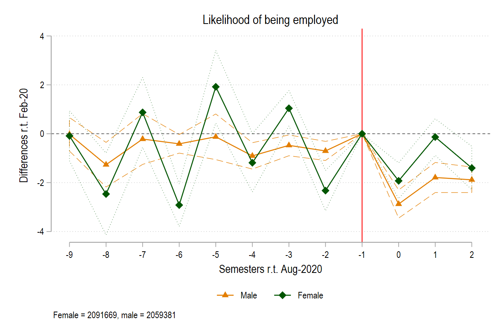

```{r setup, include=FALSE}
options(htmltools.dir.version = FALSE)
knitr::opts_chunk$set(warning = FALSE, message = FALSE, echo = FALSE)
library(tidyverse)
library(ggbrace)
library(knitr)
library(kableExtra)
```

# How did it begin?

???
* The earliest implementation of differences-in-differences dated way back to the 19th century,
as John Snow—a physician at that time—attempted to investigate the Cholera outbreak in London

* His basic question was, what caused the Cholera outbreak at that time? 

* One theory that was prevalent at that time was the Miasma theory, which stipulated 
that diseases will be spread by microscopic poisonous particles through the air. 

* However, the puzzles don't seem to fit with this theory. Multiple things have been
tried out to prevent airborne infections: covering the sick with burlap bags, etc., but
the infection still spread 

* So Snow developed a novel theory. He thinks that the disease is spread through living organisms, 
such as food and drink. The microorganism entered human's body through food and drink, 
and came out of the body, and passed into England's water supply. 

* People unknowingly drank water from the Thames river, causing them to contract Cholera. 

* But then, how could Snow validate his hypothesis? 

* In an ideal world, he would flip a coin, and assign people to drink from the contaminated Thames 
water, and others to drink from the uncontaminated water. However, that would be costly and unfeasible. 

* So he relied on a natural experiment. Natural experiments are any types of experiments in which groups are exposed to the treatment to a varying degree, as determined by the nature. So it's not like an actual experiment sort of thing, in which it's you who's doing the randomization. In natural experiments, the nature does the work for all of us.

* In his paper, he analyzes the prevalence of cholera 
using data from 1849-1854. 

* Originally, water companies served Londoners using the downstream Thames water, which contained pollution
via runoffs. 

* However, in 1852, the British parliament mandated a water company named Lambeth to move their water supply 
upstream. This gave the company access to clean water sources.
--

* Implementation goes way back to 19th century : <br>John Snow and the Cholera study

.center[]

--

* What caused cholera?

--

    + Miasma?
--
    + Snow's theory: living organisms

--

* People could be contaminated from the Thames <br>river!

--

* But how could Snow confirm his hypothesis?

--

* *Natural experiment*:

--

    + His analysis is between 1849-1854
--
    
    + Water companies originally supplied water from the contaminated Thames river
--
    
    + In 1852, Lambeth was required by the parliament to move upstream

---
# The original design

???
* In Snow's original design, the treated group is Lambeth

* Meanwhile, the Southwark and Vauxhall water company is chosen as control group. 

* In diff-in-diff method, it is important that we select as controls groups that 
tend to be most similar to the treated observations prior to the treatment. 

* Snow went to a great length to document the similarities between Lambeth and Southwark-Vauxhall
pre-1852. For example, he found that sometimes their service would irregularly cut between neighbourhoods,
such that houses on either side were similar to each other.

* [Explain $Cholera$ and $PRE$ or $POST$ periods]

* Given these setup, differences-in-differences would allow us to identify the treatment effect by two steps.
First, we calculate the pre-post differences for each of the water company. 
Once that is done, we then calculate the difference between the two pre-post differences 
of those water companies. 

* The method is called difference-in-differences—literally, because we're 
calculating those double differences. 

* [EXPLAIN THE TABLE!] The ATT would be -78 in the table.
--

 Let:

+ **Lambeth** (*L*) be the treated group
    
+ **Southwark and Vauxhall** (*SV*) be the control group

+ $Cholera$ be the outcome of interest

+ 1849 and 1854 denote pre-treatment $PRE$ and post-treatment $POST$ period.

--

$$
\begin{aligned}
\hat{TreatmentEffect} = & (Cholera_{L, POST} - Cholera_{L, PRE}) - \\
                        & (Cholera_{SV, POST} - Cholera_{SV, PRE})
\end{aligned}
$$
--

```{r lambeth_table}
lambeth_table <- tribble(
  ~Company,         ~Pre, ~Post, ~Difference, 
  'SV',             135,     147,    12,      
  'L',              85,      19,     -66, 
  '$L-SV$',         -50,    -128,    -78
)

kable(lambeth_table) %>% 
  kable_styling()

```

---
# The original design, visualized

???
* This graph visualizes the table in the previous slide.

* Explain the legends and the graph layout. (The colors, the pre-post)

* Notice the grey dot and the dotted patterns. 

* Important DiD assumption: absent the treatment, 
the treated group would have evolved similarly with the control group. 

* Explain about the potential vs actual outcome; we don't really know 
where the potential outcome is. But our assumption is that it co-moves
with the control group.

* ATT = actual outcome - assumed counterfactual
--


```{r lambeth_data_prep, cache=TRUE}
lambeth_table2 <- tribble(
  ~company, ~period, ~cholera_incidence, ~group,
  'SV', 1, 135, 'Control',
  'SV', 2, 147, 'Control',
  'L_C', 1, 85, 'Counterfactual',
  'L_C', 2, (85*(1+((147-135)/135))), 'Counterfactual',
  'L', 1, 85, 'Treatment',
  'L', 2, 19, 'Treatment', 
) %>% 
  mutate(period = factor(period, levels = c(1,2), labels = c('Before', 'After')))

# separating the actual and counterfactual
lambeth_actual <- filter(lambeth_table2, group != 'Counterfactual')
lambeth_counterfactual <- filter(lambeth_table2, group == 'Counterfactual')
```

.center[
```{r lambeth_viz, dependson='lambeth_data_prep'}

ggplot(lambeth_actual, aes(x = period, y = cholera_incidence)) +
  geom_point(data = lambeth_counterfactual, size = 5, alpha = 1/3) +
  geom_line(data = lambeth_counterfactual, 
            mapping = aes(group = group),
            linetype = 'dashed') +
  geom_point(aes(color = group), size = 5) + 
  geom_line(aes(group = company, color = group)) +
  geom_text(x = 2.25, y = 100, label = 'Counterfactual') +
  theme_bw() +
  ylab('Cholera incidence per 10,000 households') + 
  xlab('Period') +
  labs(title = "John Snow's cholera hypothesis") +
  geom_vline(xintercept = 1.5) +
  geom_brace(aes(c(2.05,2.2), c(19, 90), label = '\U03B4 (ATT)'), 
             inherit.data = F, rotate = 90, labelsize = 5) +
  theme(axis.text = element_text(size = 12),
        axis.title = element_text(size = 14),
        title = element_text(size = 16))

```
]

---
# Delving deeper

???
* We'll denote T and C as our treatment and control groups 

* Post and pre- will denote the post- and pre-treatment periods 

* Treatment of interest: TreatmentEffect. This can be calculated simply by 
taking the double difference as before. 

* Make the distinction between double difference and treatment effect. 
Treatment effect is the truth we aim to strive for

* However, it can be shown that DD is not always equal to TE. Explain about
parallel-trends bias. 

* Only if non-parallel trends bias = 0 can we be sure that DD = TE.
--

Let: 

* $T$ and $C$ be treated and control groups.

* $post$ and $pre$ denote post- and pre-treatment periods.

We're interested in $\hat{TreatmentEffect}_{TC}$.

--

Ideally,

$$
\begin{aligned}
DD_{TC}= TreatmentEffect_{TC} = & (Outcome^{post}_{T} - Outcome^{pre}_{T}) - \\
                                    & (Outcome^{post}_{C} - Outcome^{pre}_{C})
\end{aligned}
$$
--

But $DD_{TC}$ doesn't always equal to $TreatmentEffect_{TC}$

--

It can be shown that:

  $$DD_{TC} = TreatmentEffect_{TC} + NonParallelTrendBias_{TC}$$
---
# Imagine...

???
* Try to imagine a world in which your treatment doesn't exist. But assume the control and treated groups still remain the same. 

* Without your treatment, would those two groups still have evolved similarly? 

* Say you and your sibling are experiencing a headache. Then, being social scientists, you think you wanna assess the effectiveness of Panadol in easing headaches. You then compare the pre- and post-outcomes of drinking Panadol. But would such comparisons provide good estimate of Panadol's treatment effect? 

* The answer is no, if even without drinking Panadol, you or your sibling would have gotten better anyways.  

* If you have reasons to believe that your treatment and control groups wouldn't have evolved similarly in the absence of treatment, it is important that you study the factors behind those divergences. Perhaps you could control them in your regressions?

* [Explain about parallel trends assumption!]
--

.center[]

--

Imagine a world without your treatment:

--

* Would your $T$ and $C$ have evolved similarly?

--

* If not, why?

--

* Parallel trend assumption simply means your <br>
**your $T$ and $C$ would have moved similarly<br> in the absence of treatment**. 

---
# The original design, revisited

???
* [Walk through the graphs]

--

.pull-left[
```{r lambeth_viz_revisited, ref.label='lambeth_viz', echo=FALSE, fig.height=9.5, fig.width=8}
```
]

--

.pull-right[
```{r lambeth_viz_unparallel, dependson='lambeth_data_prep', fig.height=9.5, fig.width=8}
# defining a new tibble containing the unparallel data! 
lambeth_counterfactual2 <- tribble(
  ~company, ~period, ~cholera_incidence, ~group,
  'L_C', 1, 85, 'Counterfactual',
  'L_C', 2, 75, 'Counterfactual',
) %>% 
  mutate(period = factor(period, levels = c(1,2), labels = c('Before', 'After')))


# drawing the graph
ggplot(lambeth_actual, aes(x = period, y = cholera_incidence)) +
  geom_point(data = lambeth_counterfactual2, size = 5, alpha = 1/3) +
  geom_line(data = lambeth_counterfactual2, 
            mapping = aes(group = group),
            linetype = 'dashed') +
  geom_point(data = lambeth_counterfactual, size = 3, alpha = 2/3) +
  geom_line(data = lambeth_counterfactual, 
            mapping = aes(group = group),
            linetype = 'dotted') +
  geom_point(aes(color = group), size = 5) + 
  geom_line(aes(group = company, color = group)) +
  geom_text(x = 2.3, y = 77, label = 'True Counterfactual') +
  geom_text(x = 2.3, y = 97, label = 'Est. Counterfactual') +
  theme_bw() +
  ylab('Cholera incidence per 10,000 households') + 
  xlab('Period') +
  labs(title = "John Snow's cholera hypothesis, without parallel trends") +
  geom_vline(xintercept = 1.5) +
  geom_brace(aes(c(2.05,2.2), c(19, 72), label = '\U03B4 (ATT)'), 
             inherit.data = F, rotate = 90, labelsize = 5) +
  geom_brace(aes(c(1.8,1.95), c(19, 92), label = '\U03B4 (OLS)'), 
             inherit.data = F, rotate = 270, labelsize = 5) +
  theme(axis.text = element_text(size = 12),
        axis.title = element_text(size = 14),
        title = element_text(size = 16))
```

]

---
# Before we go...

???
* Parallel trends cannot really be verified because it requires us to have knowledge about two states of the world—one where your treatment exists, and another where it doesn't. So that kind of requires time travel, right? 

* What's often done is including leads and lags in the model. This means you include the interaction between treatment group dummy and pre-treatment and post-treatment time periods. 

* So basically you wanna know, whether there are significant difference in changes between treatment and control group before the treatment. This is different from studying whether the parallel trend actually holds!
--

Please remember that **parallel trends** cannot really be verified.

--

Some basic DiD extensions: 

--

* Multiple pre- and post-treatment periods: event study difference-in-differences

.center[]

--

* Staggered treatment roll-out timing

--

* Continuous treatment

